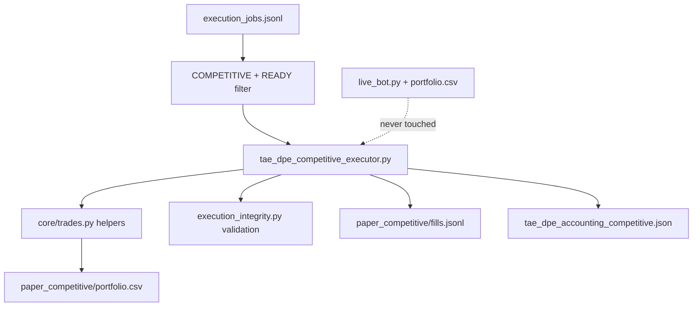

# TAE DPE-3 Architecture Recommendation

**Sprint:** DPE-3 Pre-Build Audit  
**Date:** 2026-07-07  
**Mode:** READ_ONLY · NO_EXECUTION · NO_COMMIT  
**Inputs:** `TAE_DPE3_REUSE_AUDIT.md`, `TAE_DPE3_REUSE_MATRIX.md`, `tae_dual_execution_architecture.json`

---

## Decision

**OPTION C — Build new isolated executor**

Compose existing utilities. Do **not** reuse or extend `live_bot.py`, `HistoricalExecutionEngine`, or strategy-evolution “paper” validators as the DPE-3 engine.

---

## Options evaluated

### OPTION A — Reuse existing executor

**Verdict: REJECTED**

| Criterion | Assessment |
|-----------|------------|
| Standalone paper executor exists? | **No** |
| `paper_trading_decision.py` | Empty stub |
| `ParallelPaperValidator` | Metrics validation only — zero fills |
| `HistoricalExecutionEngine` | Historical backtest jobs — wrong domain |
| `apply_rebalance_paper.py` | Writes **live** portfolio — unsafe for DPE |
| DPE architecture requirement | Isolated store under `runtime_outputs/dpe/paper_competitive/` |

**Reason:** There is no existing module that consumes DPE-2 jobs and writes to an isolated paper portfolio. Reusing any single “executor-like” module would require so much new wiring that it equals a new build, with higher risk of live-portfolio contamination.

---

### OPTION B — Extend existing executor

**Verdict: REJECTED as primary strategy (partial internal use only)**

| Extend target | Problem |
|---------------|---------|
| `live_bot.py` | Forbidden — production live path; DPE must never modify |
| `core/trades.py` | Viable to **call with parameterized portfolio path**, but trades.py is not an executor — it is a helper library |
| `HistoricalExecutionEngine` | Wrong semantics (backtest batch); name collision |
| `apply_rebalance_paper.py` | Anti-pattern — appends to live CSV |

**Reason:** “Extend” implies modifying a live or research executor in place. DPE safety rules forbid touching live paths. The correct pattern is a **new DPE module** that **imports** shared helpers (`core/trades`, `execution_integrity`) without changing their live behavior.

---

### OPTION C — Build new isolated executor ✅ SELECTED

**Verdict: ACCEPTED**

Build `tae_dpe_competitive_executor.py` (name per architecture JSON) as a shadow-only module that:

1. Reads `COMPETITIVE` + `READY` jobs from `runtime_outputs/dpe/execution_jobs.jsonl`
2. Maps `action_candidate` to competitive-philosophy paper intents (no live advisory change)
3. Writes **only** to `runtime_outputs/dpe/paper_competitive/`:
   - `portfolio.csv` (isolated, same column schema as live for reuse)
   - `trades.jsonl` or `fills.jsonl` (append-only fill journal)
   - `state.json` (cursor, last processed job_id)
4. Derives `tae_dpe_accounting_competitive.json` using patterns from `accounting_snapshot.py`
5. Never imports or calls `live_bot.py`
6. Never writes `portfolio.csv` at repo root

---

## Technical rationale for OPTION C

### 1. Architecture alignment

`tae_dual_execution_architecture.json` explicitly defines:

```text
phase 3 → tae_dpe_competitive_executor.py + paper_competitive store
storage → runtime_outputs/dpe/paper_competitive/portfolio.csv
         runtime_outputs/dpe/paper_competitive/trades.jsonl
```

No existing file satisfies this contract.

### 2. Safety isolation

DPE must maintain a hard boundary:

```text
LIVE SSOT                    DPE PAPER SSOT
portfolio.csv        ≠       runtime_outputs/dpe/paper_competitive/portfolio.csv
live_bot.py          ✗       tae_dpe_competitive_executor.py
```

OPTION C is the only option that preserves this boundary without refactoring production code.

### 3. Maximum reuse without duplication

OPTION C still achieves ~45–55% reuse by **composition**:

| Reuse layer | Module | How |
|-------------|--------|-----|
| Trade row creation | `core/trades.py` | Parameterized portfolio DataFrame + alternate save path |
| FIFO / PnL validation | `research_core/accounting/execution_integrity.py` | Validate paper fills post-write |
| Cash / positions | `core/portfolio.py` | Same math on paper CSV |
| CSV I/O pattern | `data/storage.py` | Copy pattern with `PAPER_COMPETITIVE_PORTFOLIO` constant |
| Mark-to-market | `core/portfolio_prices.py` | Optional MTM pass on paper store |
| Job contract | DPE-2 schema | Read fields directly — do not re-parse upstream JSON |
| Action vocabulary | `tae_profit_protection_shadow.py` | Map MONITOR/TRIM/REDUCE/PROTECT/HOLD_WINNER |
| Session gating | `markets/market_hours.py` | Optional — paper can run SHADOW regardless |

### 4. Avoids misleading modules

| Module | Why excluded from OPTION A/B |
|--------|------------------------------|
| `HistoricalExecutionEngine` | Backtest discovery pipeline |
| `ParallelPaperValidator` | Strategy promotion gate |
| `apply_rebalance_paper.py` | Live portfolio writer |

---

## Proposed DPE-3 architecture (build blueprint)

```text
runtime_outputs/dpe/execution_jobs.jsonl
        │
        │  filter: executor=COMPETITIVE, status=READY
        ▼
┌───────────────────────────────────────┐
│  tae_dpe_competitive_executor.py      │  ← NEW (OPTION C)
│  Mode: SHADOW_ONLY | NO_BROKER        │
└───────────────────────────────────────┘
        │
        ├── compose: core/trades (buy/sell helpers)
        ├── validate: execution_integrity (FIFO)
        ├── optional: portfolio_prices (MTM)
        │
        ▼
runtime_outputs/dpe/paper_competitive/
        ├── portfolio.csv      ← isolated paper SSOT
        ├── fills.jsonl        ← append-only fill journal
        ├── state.json         ← job cursor / idempotency
        └── accounting.json    ← derived (pattern: accounting_snapshot)
        │
        ▼
   DPE-5 Daily Result Evaluator (future)
```



---

## Implementation constraints (non-negotiable)

| Rule | Enforcement |
|------|-------------|
| NO_LIVE_BOT_CHANGE | Do not import or modify `live_bot.py` |
| NO_PORTFOLIO_CHANGE | Hard-code paper path; assert path != root `portfolio.csv` |
| NO_BROKER | Paper fills only — no broker API |
| NO_EXECUTION | Sprint scope: paper ledger writes in shadow store only |
| NO_ADVISORY_CHANGE | Read job snapshots; do not write to advisory outputs |
| Idempotent job processing | Track `job_id` in `state.json` — skip duplicates |
| Stdlib-first for DPE modules | Follow DPE-1/DPE-2 pattern; pandas only where `core/trades` requires it |

---

## What NOT to build in DPE-3

- Full trading strategy engine (already in intelligence stack)
- Recomputation of GII, targets, or philosophy scores
- Collaborative arm (DPE-4)
- Daily evaluator (DPE-5)
- Live promotion gate
- Refactor of `live_bot.py` to use `core/trades` (separate hygiene sprint)

---

## Duplication prevention checklist for DPE-3 build

- [ ] Import `buy_position` / `sell_position` from `core/trades` — do not copy from `live_bot`
- [ ] Import or mirror FIFO logic from `execution_integrity` — do not rewrite
- [ ] Read jobs from DPE-2 output — do not rebuild splitter
- [ ] Use distinct module name — avoid `HistoricalExecutionEngine` confusion
- [ ] Assert all writes under `runtime_outputs/dpe/paper_competitive/`
- [ ] Do not call `apply_rebalance_paper.py` or root `data/storage.save_portfolio` without path override

---

## Estimated effort

| Component | Reuse | New |
|-----------|-------|-----|
| Overall DPE-3 sprint | **45–55%** | **45–55%** |

---

## Audit gate result

| Item | Result |
|------|--------|
| Architecture recommendation | **OPTION C** |
| Audit PASS/FAIL | **PASS** |
| Final verdict | **READY_FOR_DPE3** |
| Recommended next sprint | **TAE DPE-3 — Competitive Paper Executor** |

---

## Safety confirmation

READ_ONLY · SHADOW_ONLY · NO_BROKER · NO_EXECUTION · NO_PORTFOLIO_CHANGE · NO_LIVE_BOT_CHANGE · NO_ADVISORY_CHANGE · NO_COMMIT
