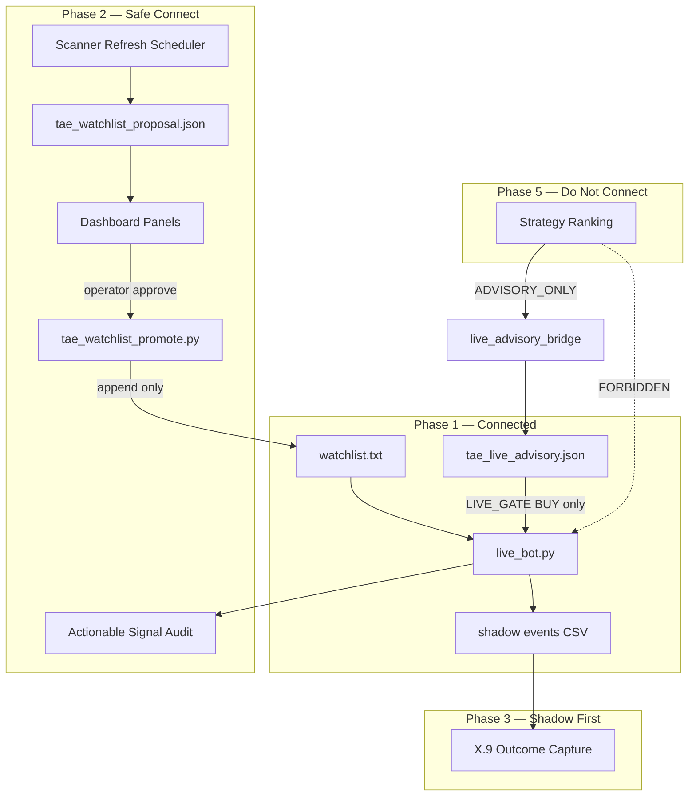

# TAE Implementation Roadmap — Connect Built Modules Safely

**Date:** 2026-06-30  
**Mode:** ARCHITECTURE + IMPLEMENTATION PLAN ONLY — no code changes in this document  
**Machine-readable:** `tae_implementation_roadmap.json`

**Source audits:** `TAE_FULL_CONSTRUCTION_INVENTORY_AUDIT.md`, `TAE_GLOBAL_MARKET_INTELLIGENCE_PRE_AUDIT.md`, `TAE_10_DAY_TRADING_AUDIT.md`, `TAE_WATCHLIST_PROMOTION_SUMMARY.md`, `PROJECT_BOOK.md`, `SESSION_START.md`

---

## Executive Summary

| | |
|---|---|
| **Verdict** | **PARTIAL** — extensive modules exist; connect via governed layers |
| **Principle** | Implement what exists; do not rebuild scanners, ranking, or historical execution |
| **Protected** | `live_bot.py` trading logic, `buy_position`/`sell_position`, scoring thresholds |
| **Allowed live touch** | `LIVE_GATE` (RISK_ADVISORY only), `SHADOW_ONLY` logging, `READ_ONLY` reports |
| **Forbidden** | Auto-BUY from scanner, ranking→`buy_position`, bypass risk gate |

---

## Connection Rules (Non-Negotiable)

1. **Universe changes** → `tae_watchlist_proposal.json` → operator approve → `tae_watchlist_promote.py --apply` → backup
2. **BUY blocking** → only via existing `should_block_new_buy()` on `RISK_ADVISORY`
3. **Strategy ranking** → advisory context / dashboard only — never ticker selection in live bot
4. **Scanner outputs** → refresh on schedule → proposal → governed promotion (never direct write except promote tool)
5. **New live_bot changes** → shadow validation sprint required unless read-only log line

---

## Phase 1 — Already Connected (Maintain)

| ID | Link | Type | Validation |
|----|------|------|------------|
| LIVE-001 | `watchlist.txt` → `live_bot.py` → CSVs | LIVE_EXECUTION | `bash tae_market_open_monitor.sh` |
| LIVE-002 | `tae_live_advisory.json` → BUY risk gate | LIVE_GATE | `python3 research_core/governance/live_advisory_runtime.py` |
| LIVE-003 | BUY path → `tae_shadow_validation_events.csv` | SHADOW_ONLY | `python3 tae_shadow_validation_report.py` |
| LIVE-004 | `markets/market_hours.py` → per-ticker BUY gate | LIVE_GATE | Session gate regression |
| LIVE-005 | Ecosystem review → Command Center | DASHBOARD_ONLY | `bash tae_full_ecosystem_review.sh` |
| LIVE-006 | Session guard → bot autostart | READ_ONLY | `bash tae_startup_verify.sh` |

**Do not refactor** without explicit sprint. Staleness fix on advisory bridge is the model for safe extensions.

---

## Phase 2 — Safe to Connect Now

No `live_bot.py` trading logic changes. Read-only reports, dashboard panels, governed config.

### Mandatory implementations (A–E)

| ID | Name | Source → Target | Type | Priority |
|----|------|-----------------|------|----------|
| **A** | **Actionable Signal Audit** | alerts + portfolio + signals → daily audit JSON/MD | READ_ONLY | **CRITICAL** |
| **B** | **Scanner Refresh Scheduler** | scanner chain → fresh CSVs + log | READ_ONLY | **CRITICAL** |
| **C** | **Watchlist Proposal Dashboard Panel** | `tae_watchlist_proposal.json` → Command Center | DASHBOARD_ONLY | **HIGH** |
| **D** | **Governed Watchlist Promotion Queue** | proposal → promote CLI + dashboard approve | ADVISORY_ONLY | **HIGH** |
| **E** | **Strategy Ranking in Advisory** | ranking JSON → advisory bridge reasons | ADVISORY_ONLY | **HIGH** |

#### A — Actionable Signal Audit

- **Problem (10-day audit):** 28 actionable STRONG BUYs, 25% execution rate; dominant skip = ALREADY_HELD; legacy false MARKET_CLOSED cost ~$565
- **Build:** Extend `tae_10_day_trading_audit.py` → rolling `tae_actionable_signal_audit.py` (24h/7d)
- **Output:** `tae_actionable_signal_audit.json` — breakdown: ALREADY_HELD, MARKET_SESSION, TAE_BLOCK, MAX_POSITIONS, REGIME, SCORE
- **Rollback:** Delete report script — zero runtime impact
- **Validate:** `python3 tae_actionable_signal_audit.py`

#### B — Scanner Refresh Scheduler

- **Problem:** CSVs were ~161h stale before manual refresh (2026-06-30)
- **Build:** `tae_scanner_refresh.sh` wrapping existing scripts in order:
  1. `global_market_scanner.py`
  2. `regional_strength_aggregator.py`
  3. `sector_rotation_scanner.py`
  4. `market_scanner.py` (`write_watchlist=False`)
  5. `PYTHONPATH=. multi_market_scanner.py`
  6. `global_candidates.py`
  7. `global_opportunity_ranking.py`
  8. `tae_watchlist_proposal.py`
- **Schedule:** Cron/LaunchAgent pre-EU open weekdays (~07:00 local)
- **Rollback:** Disable schedule; retain last CSVs
- **Validate:** `bash tae_scanner_refresh.sh && ls -lh global_opportunity_ranking.csv`

#### C — Watchlist Proposal Dashboard Panel

- **Built:** `tae_watchlist_proposal.json` (63 candidates, 10 recommended)
- **Build:** Streamlit section — recommended additions, stale flags, `runtime_evidence_used`, link to promotion
- **Rollback:** Remove UI section
- **Validate:** `python3 tae_watchlist_proposal.py`

#### D — Governed Watchlist Promotion Queue

- **Built:** `tae_watchlist_promote.py` — backup, dry-run, apply (15→25 applied 2026-06-30)
- **Build:** Dashboard queue — show proposal diff → **Approve** runs `--apply` → writes `tae_watchlist_promotion.json`
- **Never:** auto-promote without operator click
- **Rollback:** `cp backups/watchlist_*.txt watchlist.txt`
- **Validate:** `python3 tae_watchlist_promote.py --dry-run`

#### E — Strategy Ranking Alignment in Advisory

- **Built:** `tae_continuous_strategy_ranking.json`, `tae_historical_results_analysis.json`
- **Build:** Enrich `live_advisory_bridge.py` reasons with `top_strategy_id`, `ranking_score`, robust shortlist count — **no new blockers from ranking alone**
- **Not:** connect ranking to `buy_position`
- **Rollback:** Revert bridge field additions
- **Validate:** `python3 tae_live_advisory_demo.py`

### Additional safe connects

| ID | Link | Priority |
|----|------|----------|
| SAFE-F | Market Open Monitor → dashboard | MEDIUM |
| SAFE-G | Accounting SSOT → all PnL tabs | HIGH |
| SAFE-H | Macro/sector CSVs → dashboard Tab 1 | MEDIUM |

---

## Phase 3 — Needs Shadow Validation First

| ID | Name | Type | Notes |
|----|------|------|-------|
| **F** | **X.9 Outcome Capture** | SHADOW_ONLY | Forward PnL on ALLOWED vs BLOCKED BUYs |
| SHADOW-001 | SELL_ADVISORY shadow logging | SHADOW_ONLY | Log-only; never auto-SELL |
| SHADOW-002 | Position intelligence correlation | SHADOW_ONLY | Compare PI vs actual SELLs |
| SHADOW-003 | BUY_ADVISORY counterfactual | SHADOW_ONLY | Measure supportive advisory value |

### F — X.9 Outcome Capture (mandatory)

- **Built:** `tae_shadow_validation_events.csv` (BUY evaluations logged)
- **Gap (SESSION_START):** No forward PnL / avoided-loss attribution
- **Build:** Batch `tae_shadow_outcome_capture.py` — read events + portfolio forward marks → `tae_shadow_validation_outcomes.json`
- **Prerequisite:** Accumulate ≥N events before tuning gate
- **Rollback:** Disable batch job
- **Validate:** `python3 tae_shadow_outcome_capture.py --dry-run`

---

## Phase 4 — Dashboard Only

| ID | Link | Benefit |
|----|------|---------|
| DASH-001 | Stale badges on TAE JSON tab | Trust advisory index age |
| DASH-002 | Scanner CSV age indicator on Tab 1 | Prevent stale decisions |
| DASH-003 | Promotion history + rollback UI | Governed universe audit |
| DASH-004 | 10-day audit embed | Missed profit visibility |

**Zero live_bot changes.**

---

## Phase 5 — Do Not Connect Yet

| ID | Link | Why |
|----|------|-----|
| HOLD-001 | Scanner → auto-BUY | Bypasses RSI/SMA + governance |
| HOLD-002 | Ranking → buy_position | Strategy-level ≠ ticker |
| HOLD-003 | Event memory live | Scaffold only; blueprint Phase 2 |
| HOLD-004 | Position intelligence → auto-SELL | Changes SELL logic |
| HOLD-005 | Bypass RISK_ADVISORY | Violates X.8 |
| HOLD-006 | live_bot_v5_1 scanner bridge | Ungoverned watchlist overwrite |
| HOLD-007 | Historical execution → live | Research ≠ live signals |

---

## Phase 6 — Deprecated / Cleanup

| ID | Item | Action |
|----|------|--------|
| DEP-001 | `live_bot_v5_1.py` | Archive; remove from runbooks |
| DEP-002 | `auto_watchlist.py` | Deprecate direct write |
| DEP-003 | `universe_from_candidates.py` | Use promote tool only |
| DEP-004 | Dual regional strength | Single macro SSOT (ETF scanner) |
| DEP-005 | `core/market_hours.py` | Consolidate to `markets/` |
| DEP-006 | Stale Tab 1 allocator panels | Hide or wire refresh |

---

## Sprint Sequence

| Sprint | Title | Items | live_bot changes? |
|--------|-------|-------|-------------------|
| **X.10A** | Observability & Fresh Data | A, B, DASH-002, SAFE-F | **No** |
| **X.10B** | Governed Universe UI | C, D, DASH-003 | **No** |
| **X.10C** | Advisory Enrichment | E, SAFE-G | **No** |
| **X.10D** | Shadow Outcomes | F, SHADOW-003 | **No** |
| **X.11** | Cleanup | DEP-* | **No** |

---

## Top 10 Implementation Links

| Rank | ID | Name | Phase | Priority |
|------|-----|------|-------|----------|
| 1 | SAFE-A | Actionable Signal Audit | 2 | CRITICAL |
| 2 | SAFE-B | Scanner Refresh Scheduler | 2 | CRITICAL |
| 3 | SAFE-C | Watchlist Proposal Dashboard Panel | 2 | HIGH |
| 4 | SAFE-D | Governed Watchlist Promotion Queue | 2 | HIGH |
| 5 | SAFE-E | Strategy Ranking Alignment in Advisory | 2 | HIGH |
| 6 | SHADOW-F | X.9 Outcome Capture | 3 | HIGH |
| 7 | SAFE-G | Accounting SSOT dashboard unification | 2 | HIGH |
| 8 | DASH-002 | Scanner freshness indicator | 4 | HIGH |
| 9 | SAFE-F | Market Open Monitor dashboard | 2 | MEDIUM |
| 10 | SAFE-H | Macro/sector dashboard panels | 2 | MEDIUM |

---

## What to Implement First

**Sprint X.10A (this week):**

1. **A — Actionable Signal Audit** — closes the loop on "why didn't we BUY?" from 10-day audit
2. **B — Scanner Refresh Scheduler** — prevents stale proposals (root cause of 161h gap)
3. **DASH-002 — Freshness badges** — quick win on Tab 1
4. **SAFE-F — Monitor panel** — ops visibility

**Sprint X.10B (next):**

5. **C + D — Proposal + Promotion UI** — completes governed universe path (already proven CLI)

**Sprint X.10C:**

6. **E — Ranking in advisory** — richer context without execution risk

**Sprint X.10D:**

7. **F — Shadow outcomes** — prerequisite for any future gate tuning

---

## What NOT to Implement Yet

- Auto-BUY from `global_opportunity_ranking.csv`
- Strategy ranking wired to `buy_position()`
- Bypass or override `RISK_ADVISORY` / `should_block_new_buy()`
- Position intelligence driving automatic SELL
- Event memory ingestion into live advisory
- Reactivating `live_bot_v5_1.py` auto-scanner bridge
- Direct `auto_watchlist.py` / `universe_from_candidates.py` writes

---

## Architecture Diagram



---

## Validation

```bash
python3 -m json.tool tae_implementation_roadmap.json
git status
```

No code modified in this roadmap sprint.
