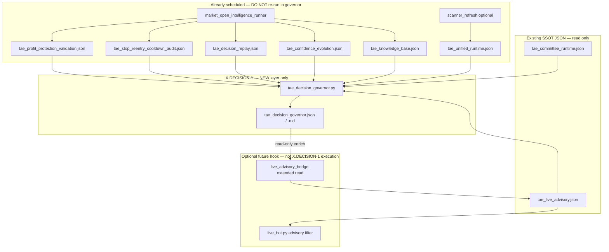

# TAE X.DECISION-1 — Pre-Build Architecture Audit

**Date:** 2026-07-05  
**Mode:** READ-ONLY · no code changes · no refactor  
**Purpose:** Determine whether a Decision Governor / Advisory Governor Composer already exists before X.DECISION-1 implementation.

---

## 1. Executive verdict

**No module today performs full orchestration of all seven domains** (unified runtime, advisory runtime, replay, protection, cooldown, knowledge, confidence) **plus committee** into a single decision-governor VIEW.

What exists instead is a **layered patchwork**:

| Layer | Role today | Closest to Decision Governor? |
|-------|------------|-------------------------------|
| **Execution** | `live_bot.py` | Actual BUY/SELL brain (not governor) |
| **Live advisory filter** | `live_advisory_bridge.py` → `live_advisory_runtime.py` | Partial — blocks new BUY only |
| **Unified ticker SSOT** | `unified_runtime_builder.py` | Per-ticker merge, no decision posture |
| **Intraday shadow stack** | `tae_market_open_intelligence_runner.py` | Runs analysis chain, no governor VIEW |
| **Legacy ecosystem** | `ecosystem_orchestrator.py`, `tae_scanner_refresh.py` | Different domain (strategy evolution / scanner) |
| **Observability** | `tae_full_ecosystem_review.py`, `dashboard_tae_command_center.py` | Read/display only |

**Recommendation:** Build X.DECISION-1 as a **read-only orchestration + materialization VIEW** that **consumes existing JSON outputs** — do not re-run analysis, do not replace `live_advisory_bridge` logic wholesale, do not touch `live_bot.py` execution.

---

## 2. Candidate modules (by domain)

### 2.1 Unified runtime

#### A. `tae_unified_runtime.py` + `research_core/meta_intelligence_runtime/unified_runtime_builder.py`

| Field | Detail |
|-------|--------|
| **Responsibility** | Merge per-ticker records from committee, research, meta, allocation, macro, sector, confidence, counterfactual, ecosystem, strategy simulation enrichers + `live_signals.csv`. |
| **Inputs** | `live_signals.csv`, `tae_*_runtime.json` artifacts, candidate CSVs, learning fields. |
| **Outputs** | `tae_unified_runtime.json` (SSOT per ticker). |
| **Overlap with Decision Governor** | **Medium** — supplies ticker-level intelligence context but **does not** arbitrate BUY/SELL, merge shadow gates, or produce governor readiness. Governor should **read** this, not rebuild it. |

#### B. `tae_scanner_refresh.py`

| Field | Detail |
|-------|--------|
| **Responsibility** | Subprocess orchestrator: research → committee → meta → allocation → … → **confidence_runtime** → **unified_runtime** → candidate queue → watchlist proposal. |
| **Inputs** | `live_signals.csv`, sector CSVs, prior runtime JSONs. |
| **Outputs** | Step log + `tae_unified_runtime.json`, `tae_candidate_queue.json`, etc. |
| **Overlap** | **Low–Medium** — runs **legacy runtime pipeline**, not intraday PROTECT/COOLDOWN/replay stack. Competes with market-open runner on “who orchestrates” but different scope. |

#### C. `research_core/meta_intelligence_runtime/unified_runtime_ssot.py`

| Field | Detail |
|-------|--------|
| **Responsibility** | Read-only accessor for `tae_unified_runtime.json`. |
| **Inputs** | `tae_unified_runtime.json` |
| **Outputs** | In-memory SSOT API (used by `live_advisory_bridge`, dashboard). |
| **Overlap** | **High as consumer helper** — Decision Governor should reuse this reader, not duplicate parsing. |

---

### 2.2 Advisory runtime

#### D. `research_core/governance/live_advisory_bridge.py` + `tae_live_advisory_demo.py`

| Field | Detail |
|-------|--------|
| **Responsibility** | Build **`tae_live_advisory.json`**: action (`NO_ACTION` / `BUY_ADVISORY` / `SELL_ADVISORY` / `RISK_ADVISORY`), `block_new_buy`, confidence, blockers. Reads advisory index, portfolio, signals, unified runtime summaries, selected legacy TAE reports. |
| **Inputs** | `tae_advisory_index.json`, `portfolio.csv`, `live_signals.csv`, `tae_unified_runtime.json`, bot/dashboard status, `RELEVANT_TAE_REPORTS` (meta intelligence, strategy ranking, etc.). |
| **Outputs** | `tae_live_advisory.json` |
| **Overlap** | **High** — closest existing **live advisory composer**. Does **not** ingest PROTECT-2, COOLDOWN-1, replay, confidence evolution, or knowledge base entries. Decision Governor would **extend or sit upstream** of this bridge, not replace execution hook. |

#### E. `research_core/governance/live_advisory_runtime.py`

| Field | Detail |
|-------|--------|
| **Responsibility** | **Consumer** of `tae_live_advisory.json` inside `live_bot.py` — `should_block_new_buy()` on `RISK_ADVISORY` only. |
| **Inputs** | `tae_live_advisory.json` |
| **Outputs** | In-memory `LiveAdvisoryRuntimeState` (no file). |
| **Overlap** | **High as live integration point** — Decision Governor must **not** bypass this; any new VIEW feeds bridge → this runtime. |

#### F. `research_core/governance/advisory_index.py`

| Field | Detail |
|-------|--------|
| **Responsibility** | Catalog all `tae_*.json` reports by category with freshness/verdict metadata. |
| **Inputs** | Glob of `tae_*.json` |
| **Outputs** | `tae_advisory_index.json` |
| **Overlap** | **Low–Medium** — index/discovery, not decision synthesis. Governor may reference for staleness warnings. |

---

### 2.3 Replay

#### G. `tae_decision_replay_composer.py` (X.REPLAY-1)

| Field | Detail |
|-------|--------|
| **Responsibility** | Shadow VIEW: failure attribution, counterfactual comparison, promotion readiness merge (PROTECT + COOLDOWN), top costly decisions. |
| **Inputs** | `tae_profit_protection_validation.json`, `tae_stop_reentry_cooldown_audit.json`, `tae_accounting_snapshot.json`, `tae_knowledge_base.json`, optional portfolio/attribution. |
| **Outputs** | `tae_decision_replay.json`, `tae_decision_replay.md` |
| **Overlap** | **High** — already a **partial decision governor** for intraday performance domain. X.DECISION-1 should **normalize/read** this, not re-implement replay logic. |

#### H. `decision_replay_engine.py` (legacy V32)

| Field | Detail |
|-------|--------|
| **Responsibility** | Legacy daily intelligence replay over `decision_registry.csv`. |
| **Inputs** | `decision_registry.csv`, portfolio history |
| **Outputs** | `decision_replay_summary.txt` |
| **Overlap** | **Low** — superseded by X.REPLAY-1 for current stack; do not merge. |

---

### 2.4 Protection (PROTECT-2)

#### I. `tae_profit_protection_validation.py` + `tae_profit_protection_shadow.py`

| Field | Detail |
|-------|--------|
| **Responsibility** | Shadow validation of exit strategies on fade history; gates G1–G6 → `advisory_readiness`. |
| **Inputs** | `runtime_outputs/tae_intraday_fade_history.csv`, optional shadow/discovery/knowledge JSON. |
| **Outputs** | `tae_profit_protection_validation.json`, `tae_profit_protection_shadow.json` |
| **Overlap** | **Medium** — SSOT for protection hypothesis + readiness. Governor reads gates/verdict; does not re-validate. |

---

### 2.5 Cooldown (COOLDOWN-1)

#### J. `tae_stop_reentry_cooldown_audit.py`

| Field | Detail |
|-------|--------|
| **Responsibility** | STOP→reentry audit, cooldown simulation, score persistence, gates G1–G5. |
| **Inputs** | `portfolio.csv` (read-only), optional `live_signals.csv`, `tae_accounting_snapshot.json` |
| **Outputs** | `tae_stop_reentry_cooldown_audit.json` |
| **Overlap** | **Medium** — SSOT for reentry/cooldown readiness. Governor merges with PROTECT readiness (replay composer already does this). |

---

### 2.6 Knowledge

#### K. `tae_knowledge_base.py` (X.KNOWLEDGE-1A/1C)

| Field | Detail |
|-------|--------|
| **Responsibility** | Materialized VIEW over discovery, evidence, learning, fade history, **confidence evolution** ingest. |
| **Inputs** | Multiple upstream JSON/CSV including `tae_confidence_evolution.json` |
| **Outputs** | `tae_knowledge_base.json`, `.md`, `tae_knowledge_summary.md` |
| **Overlap** | **Medium** — cognitive patterns VIEW. Governor reads entries (especially `source=confidence_evolution`); does not rebuild knowledge. |

---

### 2.7 Confidence evolution

#### L. `tae_confidence_evolution.py` (X.KNOWLEDGE-1B)

| Field | Detail |
|-------|--------|
| **Responsibility** | Confidence evolution VIEW + score decay candidates + `evidence_for_knowledge_base`. |
| **Inputs** | COOLDOWN, replay, PROTECT, knowledge base JSON |
| **Outputs** | `tae_confidence_evolution.json` |
| **Overlap** | **High** — bridges replay/protection/cooldown into cognitive evolution. Governor should ingest promotion_readiness + hypotheses from here. |

#### M. `tae_confidence_runtime.py` + `research_core/confidence_runtime/confidence_runner.py`

| Field | Detail |
|-------|--------|
| **Responsibility** | **Legacy** committee vote-accuracy confidence pipeline (V20.x path). |
| **Inputs** | Committee artifacts, vote CSVs |
| **Outputs** | `tae_confidence_runtime.json` → folded into unified runtime |
| **Overlap** | **Low** — different “confidence” domain from X.KNOWLEDGE-1B. Governor may surface as legacy context only. |

---

### 2.8 Committee

#### N. `tae_committee_runtime.py` + `research_core/committee_runtime/committee_runner.py`

| Field | Detail |
|-------|--------|
| **Responsibility** | Run strategic committee scripts (votes, weights, weighted decision). |
| **Inputs** | `strategic_committee.py`, `committee_confidence_engine.py`, etc. |
| **Outputs** | `tae_committee_runtime.json`, text summaries |
| **Overlap** | **Low–Medium** — legacy strategic layer; merged into unified runtime, **not** connected to intraday shadow stack. |

#### O. `weighted_committee_decision.py`, `strategic_committee.py`

| Field | Detail |
|-------|--------|
| **Responsibility** | Standalone committee vote aggregation (V20–V28 era). |
| **Inputs** | `adaptive_weights.csv`, committee summaries |
| **Outputs** | `weighted_committee_decision.txt` |
| **Overlap** | **Low** — not wired to current performance stack. |

---

### 2.9 Cross-domain orchestrators (multi-domain)

#### P. `tae_market_open_intelligence_runner.py`

| Field | Detail |
|-------|--------|
| **Responsibility** | **Subprocess orchestrator** for intraday stack: infra → fade → discovery → protect shadow/validation → cooldown → **replay** → **confidence evolution** → **knowledge base**. |
| **Inputs** | Runs Python modules in order |
| **Outputs** | `tae_market_open_intelligence_runner.json`, log |
| **Overlap** | **High for execution scheduling** — already runs 6/7 shadow domains. **Does not** produce governor VIEW or read unified runtime/committee. Decision Governor = **next step after this runner**, not replacement. |

#### Q. `tae_full_ecosystem_review.py`

| Field | Detail |
|-------|--------|
| **Responsibility** | Daily observability: financial, runtime health, **live advisory** section, shadow ledger, market readiness. |
| **Inputs** | portfolio, signals, `tae_live_advisory.json`, accounting, many artifacts |
| **Outputs** | `tae_full_ecosystem_review.json` |
| **Overlap** | **Medium** — broad review overlaps governor **reporting** but does not ingest replay/protect/cooldown/confidence stack. |

#### R. `research_core/orchestrator/ecosystem_orchestrator.py`

| Field | Detail |
|-------|--------|
| **Responsibility** | Strategy evolution chain: inventory → evidence → integration gate → daily runner → promotion gate. |
| **Inputs** | Evidence engine, strategy evolution modules |
| **Outputs** | `tae_ecosystem_orchestrator.json` (via demo) |
| **Overlap** | **Low** — different pipeline (paper strategy promotion), not intraday decision governor. |

#### S. `dashboard_tae_command_center.py`

| Field | Detail |
|-------|--------|
| **Responsibility** | Streamlit **display** of advisory, unified runtime, committee, confidence runtime, ecosystem review. |
| **Inputs** | JSON artifacts (read-only) |
| **Outputs** | UI only |
| **Overlap** | **Low** — consumer of governor output once built; not an orchestrator. |

---

## 3. Overlap matrix vs proposed Decision Governor

| Capability | Existing owner | Governor should… |
|------------|----------------|------------------|
| Run analysis modules | `tae_market_open_intelligence_runner.py`, `tae_scanner_refresh.py` | **Not duplicate** — assume JSON fresh |
| Per-ticker SSOT | `unified_runtime_builder.py` | **Read** `tae_unified_runtime.json` |
| Live advisory artifact | `live_advisory_bridge.py` | **Read** + optionally emit enriched advisory VIEW |
| Failure attribution | `tae_decision_replay_composer.py` | **Read** `tae_decision_replay.json` |
| Protection readiness | `tae_profit_protection_validation.py` | **Read** gates |
| Cooldown readiness | `tae_stop_reentry_cooldown_audit.py` | **Read** gates |
| Cognitive patterns | `tae_knowledge_base.py` | **Read** confidence_evolution entries |
| Score decay hypotheses | `tae_confidence_evolution.py` | **Read** candidates + readiness |
| Committee posture | `tae_committee_runtime.json` / unified runtime | **Read** summary fields only |
| BUY/SELL execution | `live_bot.py` | **Never modify** in X.DECISION-1 |

---

## 4. Gaps (why X.DECISION-1 is still needed)

1. **No single JSON** merges unified runtime + shadow stack readiness + knowledge hypotheses.
2. **`live_advisory_bridge`** predates PROTECT-2 / COOLDOWN-1 / X.REPLAY-1 / X.KNOWLEDGE-1B/1C — does not surface score decay or trailing/cooldown shadow posture.
3. **`tae_decision_replay_composer`** covers performance attribution but is not named or structured as governor; no link to unified runtime or committee.
4. **Two orchestrators** (`tae_scanner_refresh` vs `tae_market_open_intelligence_runner`) serve different eras — no top-level “decision posture” VIEW.
5. **Committee + intraday shadow** never meet in one advisory materialization layer.

---

## 5. Minimal architecture — Decision Governor as orchestration/materialization ONLY



### 5.1 Decision Governor responsibilities (ONLY)

| Do | Do not |
|----|--------|
| Load existing JSON artifacts | Re-run fade/protect/cooldown modules |
| Normalize readiness: PROTECT, COOLDOWN, combined replay | Recompute counterfactuals |
| Pull top knowledge/confidence hypotheses | Write `tae_knowledge_base.json` |
| Summarize unified runtime + committee context | Merge ticker SSOT |
| Emit `tae_decision_governor.json` VIEW | Emit BUY/SELL orders |
| Mark `SHADOW_ONLY` / `NOT_READY` / `WATCH` | Modify `live_bot.py` |

### 5.2 Suggested output schema (materialization)

```json
{
  "schema": "tae_decision_governor",
  "mode": "SHADOW_ONLY",
  "view_type": "MATERIALIZED_VIEW",
  "sources_loaded": { "...": true },
  "readiness": {
    "protect": "WATCH",
    "cooldown": "NOT_READY",
    "combined": "NOT_READY"
  },
  "primary_cause": "MISSED_PROFIT_PROTECTION",
  "shadow_hypotheses": ["shadow_trailing_1", "cooldown_15m", "SCORE_DECAY_SHADOW"],
  "knowledge_entries_cited": ["kb_ce_score_persistence_after_stop", "..."],
  "unified_runtime_summary": { "record_count": N, "strong_buy_count": M },
  "committee_summary": { "...": "from unified or committee JSON" },
  "live_advisory_mirror": { "action": "...", "block_new_buy": false },
  "recommendations": ["CONTINUE_OBSERVATION", "DO_NOT_PROMOTE_TO_LIVE"],
  "governor_note": "Orchestration VIEW only — live execution remains live_bot.py"
}
```

### 5.3 Integration sequence (minimal)

1. **Schedule:** `market_open_intelligence_runner` (already in `market_open_runner.sh`) → produces shadow stack JSON.
2. **Schedule:** `tae_scanner_refresh` or unified runtime refresh (existing) → `tae_unified_runtime.json`.
3. **NEW:** `tae_decision_governor.py` runs **after** both, read-only.
4. **Later (X.DECISION-2):** `live_advisory_bridge` optionally reads `tae_decision_governor.json` for richer blockers — still advisory-only.

### 5.4 Files to create in X.DECISION-1 (future sprint — not this audit)

| File | Role |
|------|------|
| `tae_decision_governor.py` | Read-only composer |
| `tae_decision_governor_test.py` | Tests |
| `tae_decision_governor.json` / `.md` | Outputs |

**Do not create in X.DECISION-1:** new analysis engines, new promotion gates, live score changes.

---

## 6. Conclusion

| Question | Answer |
|----------|--------|
| Does a Decision Governor exist? | **No** — partial overlap in replay composer + live advisory bridge |
| Closest existing orchestrator? | **`tae_market_open_intelligence_runner.py`** (shadow stack) + **`live_advisory_bridge.py`** (live advisory) |
| Safest build approach? | **Materialization-only governor** reading 7+ JSON SSOTs |
| live_bot impact? | **None** in X.DECISION-1; advisory bridge hook is optional later |

**Proceed with X.DECISION-1** as a thin read-only composer — not a greenfield decision brain.

---

*Read-only audit. No code modified.*
