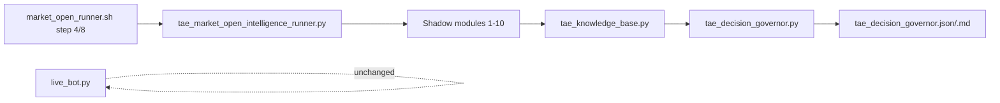

# TAE X.DECISION-2A — Governor Wiring into Market Open Flow

**Date:** 2026-07-05  
**Mode:** SHADOW_ONLY | PAPER_ONLY | NO_BROKER  
**Live trading impact:** NONE

## Goal

Wire `tae_decision_governor.py` into the existing market-open intelligence flow so the governor VIEW refreshes automatically after shadow intelligence outputs are generated.

## Pre-implementation inspection

### `market_open_runner.sh`

- Step **[4/8]** already invokes `tae_market_open_intelligence_runner.py` (SHADOW_ONLY).
- Steps 5–8 run morning update, daily intelligence, session guard, and status — **not** suitable for governor insertion (post-shadow stack only).
- **Decision:** No shell change required; governor belongs inside the intelligence runner pipeline already triggered at step 4.

### `tae_market_open_intelligence_runner.py`

- Orchestrates 10 shadow modules via `MODULE_PIPELINE` and `subprocess.run([python_bin, script])`.
- Failures log WARN/FAIL but do not stop the live bot.
- Protected files (`live_bot.py`, `portfolio.csv`, `live_signals.csv`) are snapshotted before/after.
- **Safest insertion point:** append as step **11**, immediately after `knowledge_base` (step 10), so all upstream JSON VIEWs exist before materialization.

## Implementation

### Changed files

| File | Change |
|------|--------|
| `tae_market_open_intelligence_runner.py` | Added pipeline entry `decision_governor` → `tae_decision_governor.py` |
| `tae_market_open_intelligence_runner_test.py` | Updated order test: 11 modules; last = `decision_governor` |

### Unchanged (by design)

| File | Status |
|------|--------|
| `live_bot.py` | **Not modified** |
| `market_open_runner.sh` | **Not modified** for X.DECISION-2A (still calls intelligence runner at [4/8]) |
| `tae_decision_governor.py` | **Not modified** — materialization-only, no engine re-runs |
| Live advisory bridge / execution | **No governor dependency added** |

### Pipeline order (post-change)

1. infrastructure_health  
2. intraday_fade_intelligence  
3. fade_history  
4. intraday_discovery  
5. profit_protection_shadow  
6. profit_protection_validation  
7. cooldown_audit  
8. decision_replay  
9. confidence_evolution  
10. knowledge_base  
11. **decision_governor** ← new

## Validation

| Check | Result |
|-------|--------|
| `bash -n market_open_runner.sh` | PASS |
| `python3 -m py_compile tae_decision_governor.py` | PASS |
| `python3 -m py_compile tae_market_open_intelligence_runner.py` | PASS |
| `python3 -m unittest tae_market_open_intelligence_runner_test.py` | **7/7 PASS** |
| Full intelligence runner (manual) | **11/11 modules executed**; step 11 `decision_governor` **PASS** (2.32s) |
| Governor timestamp refresh | `2026-07-05T20:30:42` → `2026-07-05T20:31:02` via runner |
| `live_bot.py` diff | **None** |
| BUY/SELL execution paths | **Unchanged** — governor is subprocess VIEW refresh only |
| Live advisory depends on governor | **No** |

### Intelligence runner run (2026-07-05T20:31)

- Overall: FAIL (pre-existing: `infrastructure_health` step 1)
- Shadow stack steps 2–10: PASS
- **Step 11 `decision_governor`: PASS**
- Governor outputs refreshed: `tae_decision_governor.json`, `tae_decision_governor.md`

### Governor snapshot (post-run)

- Overall advisory posture: **NOT_READY**
- Shadow readiness: **NOT_READY**
- Tickers: 63 | ALLOWED: 44 | WATCH: 19 | Blockers: 7

## Architecture note

The governor reads existing materialized JSON (replay, knowledge base, confidence evolution, etc.) and writes a consolidated advisory VIEW. It does **not** re-run analysis engines and does **not** feed back into live execution.

## Commit status

**Stopped without commit** per sprint instructions.
