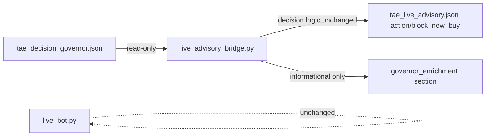

# TAE X.DECISION-2B — Live Advisory Read-Only Enrichment

**Date:** 2026-07-05  
**Mode:** SHADOW_ONLY | PAPER_ONLY | NO_BROKER  
**Commit:** None (per sprint instructions)

## Goal

Allow `live_advisory_bridge.py` to read `tae_decision_governor.json` **only** for advisory/report enrichment — informational context, no live blocking control.

## Pre-implementation inspection

| Artifact | Role |
|----------|------|
| `research_core/governance/live_advisory_bridge.py` | Builds `tae_live_advisory.json`; `_derive_advisory()` owns action/confidence |
| `tae_live_advisory.json` | Schema `tae.live_advisory.v1`; decision fields: `action`, `block_new_buy`, `advisory.*` |
| `tae_decision_governor.json` | Shadow VIEW; `overall_advisory_posture`, `readiness`, `posture_counts`, `blocker_summary`, `shadow_verdict` |

**Safest enrichment fields (read-only, no gate coupling):**

- `overall_advisory_posture`
- `readiness` (protect / cooldown / final)
- `posture_counts`
- `shadow_verdict` (primary cause, hypothesis)
- Capped `blocker_codes` sample
- Capped `ticker_posture_sample` (WATCH/BLOCKED only)
- `advisory_notes` sample
- Metadata: `generated_at`, `mode`, `sources_loaded_count`, `governor_note`
- Explicit flags: `informational_only: true`, `controls_live_blocking: false`

**Not imported into decision logic:** governor blockers do not append to `advisory.blockers`; governor posture does not change `action` or `block_new_buy`.

## Implementation

### Files changed

| File | Change |
|------|--------|
| `research_core/governance/live_advisory_bridge.py` | `_extract_governor_enrichment()`, `_load_governor_enrichment()`, `governor_enrichment` on report + JSON output, markdown section in `format_text()` |
| `research_core/governance/live_advisory_bridge_test.py` | **New** — 4 unit tests |

**Unchanged:** `live_bot.py`, `_derive_advisory()`, `block_new_buy` property (`RISK_ADVISORY` only), BUY/SELL execution paths.

### Output schema additions

Top-level:

```json
"governor_enrichment": {
  "present": true,
  "informational_only": true,
  "controls_live_blocking": false,
  "source": "tae_decision_governor.json",
  "overall_advisory_posture": "NOT_READY",
  "readiness": { "final_status": "...", "protect_readiness": "...", "cooldown_readiness": "..." },
  "posture_counts": { "ALLOWED": 44, "WATCH": 19, ... },
  "shadow_verdict": { "primary_cause": "...", ... },
  "blocker_codes": [ ... ],
  "ticker_posture_sample": [ ... ]
}
```

`safety` block extended:

```json
"governor_informational_only": true,
"governor_controls_live_blocking": false
```

## Validation

| Check | Result |
|-------|--------|
| `python3 -m py_compile research_core/governance/live_advisory_bridge.py` | PASS |
| `python3 -m unittest research_core.governance.live_advisory_bridge_test` | **4/4 PASS** |
| `python3 tae_live_advisory_demo.py` | PASS — enriched JSON written |
| Decision fields unchanged | **action** `SELL_ADVISORY`, **block_new_buy** `false`, **confidence** `78` (same as pre-run) |
| Governor informational only | `informational_only: true`, `controls_live_blocking: false` |
| `live_bot.py` | **Unchanged** |

### Live run snapshot (2026-07-05)

```
Action: SELL_ADVISORY
block_new_buy: False
governor_enrichment.present: True
governor_enrichment.overall_advisory_posture: NOT_READY
readiness: final=NOT_READY protect=WATCH cooldown=NOT_READY
posture_counts: ALLOWED=44 WATCH=19
shadow_verdict.primary: MISSED_PROFIT_PROTECTION
```

## Architecture note



Governor enrichment is a **parallel VIEW attachment**. X.8 BUY-block behavior remains: `block_new_buy == (action == RISK_ADVISORY)`.

## Commit status

**Stopped without commit.**
