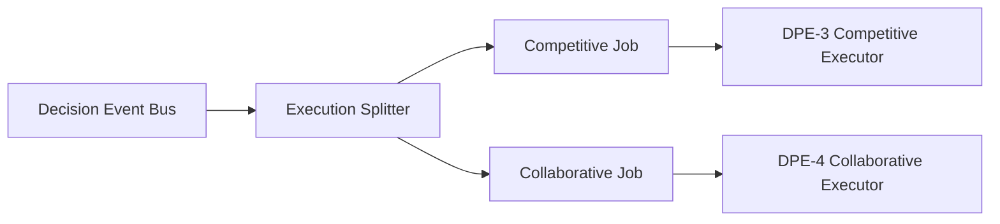

# TAE DPE-2 — Execution Splitter Sprint Report

**Sprint:** DPE-2 — Execution Splitter  
**Date:** 2026-07-07  
**DPE roadmap:** Phase 2 of 10  
**Mode:** READ_ONLY · SHADOW_ONLY · NO_BROKER · NO_EXECUTION · NO_PORTFOLIO_CHANGE · NO_LIVE_BOT_CHANGE · NO_ADVISORY_CHANGE · NO_COMMIT  
**Status:** **PASS**

---

## Summary

Created the **Execution Splitter** — the single routing layer between the Decision Event Bus (DPE-1) and future paper executors (DPE-3/DPE-4). Each Decision Event fans out into one **COMPETITIVE** and one **COLLABORATIVE** job. No execution, no portfolio changes, no live behavior changes.

---

## Files created

| File | Role |
|------|------|
| `tae_execution_splitter.py` | Splitter engine (stdlib only) |
| `tae_execution_splitter.json` | Machine-readable schema + metrics |
| `tae_execution_splitter.md` | Human-readable report |
| `tae_cli/commands/dpe_splitter.py` | CLI command |
| `runtime_outputs/dpe/execution_jobs.jsonl` | Append-only job log |
| `TAE_DPE2_EXECUTION_SPLITTER_REPORT.md` | This report |

**Modified (CLI only):** `tae_cli/dispatcher.py`, `tae_cli/commands/help.py`

**Not modified:** `live_bot.py`, `core/`, `portfolio.csv`, `live_signals.csv`, `watchlist.txt`, upstream engines

---

## Architecture summary

```text
decision_events.jsonl
        │
        ▼
  Execution Splitter (DPE-2)
        │
   ┌────┴────┐
   │         │
   ▼         ▼
COMPETITIVE  COLLABORATIVE
  Job A        Job B
   │         │
   └────┬────┘
        ▼
execution_jobs.jsonl  →  DPE-3 / DPE-4 Paper Executors
```

Each Decision Event produces exactly two jobs sharing the same `decision_uuid` and `experiment_id`, differentiated only by `executor`.

---

## Routing diagram



---

## Job schema summary

**Schema version:** `dpe.execution_job.v1`

**Required fields:** job_id, decision_uuid, experiment_id, parent_event_id, timestamp, executor, ticker, action_candidate, market_snapshot, portfolio_snapshot, growth_snapshot, target_snapshot, policy_snapshot, philosophy_snapshot, status, schema_version

**Extended fields:** event_origin, decision_reason, decision_context, source, mode, parent_event_type

**executor enum:** COMPETITIVE, COLLABORATIVE

**status enum:** QUEUED, READY, BLOCKED, INVALID (no EXECUTED in this sprint)

**event_origin:** SHADOW (from Decision Event mode)

---

## Reuse audit

| Artifact | Use |
|----------|-----|
| `runtime_outputs/dpe/decision_events.jsonl` | Parent events (DPE-1) |
| `tae_growth_intelligence.json` | decision_context growth_phase, regime |
| `tae_profit_growth_analytics.json` | decision_context breadth, volatility |
| `tae_adaptive_profit_policy_engine.json` | policy enrichment flag |
| `tae_portfolio_profit_governor.json` | portfolio_policy in decision_context |
| `tae_profit_target_adapter.json` | target_snapshot passthrough |
| `tae_market_philosophy_lab.json` | philosophy_snapshot passthrough |

**No duplicated computations.** Snapshots are copied from Decision Events; supplemental JSON enriches `decision_context` only.

---

## Validation results

```bash
python3 tae_execution_splitter.py          # PASS
python3 tae.py dpe-splitter                # PASS
python3 tae.py help                        # PASS (includes dpe-splitter)
FORBIDDEN_IMPORTS: []                       # PASS
git status — no forbidden file mods         # PASS
```

| Metric | Value |
|--------|-------|
| Decision events processed | 39 (deduped from event log) |
| Jobs built per run | 78 |
| Competitive jobs | 39 |
| Collaborative jobs | 39 |
| Blocked jobs | 6 (philosophy AVOID / defensive) |
| Ready jobs | 72 |
| Invalid jobs | 0 |
| Duplicate UUID anomalies | 0 |
| Duplicate job IDs in run | 0 |
| Experiment ID | EXP687546 |
| All 7 input sources loaded | ✅ |

---

## Schema verification

- Each event → 2 jobs (COMPETITIVE + COLLABORATIVE) ✅
- Shared `decision_uuid` per event pair ✅
- Deterministic `job_id` from parent_event_id + executor ✅
- No EXECUTED status ✅
- No upstream Python imports ✅
- Stdlib only ✅

---

## DPE roadmap placement

```text
✅ 0. Intelligence Stack
✅ Growth Stack
✅ DPE Architecture
✅ DPE-1 Decision Event Bus
✅ DPE-2 Execution Splitter          ← THIS SPRINT
→  DPE-3 Competitive Paper Executor    ← NEXT
   DPE-4 Collaborative Paper Executor
   DPE-5 Daily Result Evaluator
   DPE-6 Philosophy Learning
   DPE-7 Adaptive Philosophy Selector
```

---

## Recommended next sprint

```text
TAE DPE-3 — Competitive Paper Executor
```

Consume `COMPETITIVE` jobs with status `READY` from `runtime_outputs/dpe/execution_jobs.jsonl`.

---

## Confirmations

| Rule | Status |
|------|--------|
| READ_ONLY | ✅ |
| SHADOW_ONLY | ✅ |
| NO_BROKER | ✅ |
| NO_EXECUTION | ✅ |
| NO_PORTFOLIO_CHANGE | ✅ |
| NO_LIVE_BOT_CHANGE | ✅ |
| NO_ADVISORY_CHANGE | ✅ |
| NO_COMMIT | ✅ |

---

## Overall verdict

**PASS** — DPE-2 Execution Splitter operational. Single routing layer established between Decision Event Bus and future dual paper executors. Contains no execution logic and no trading rules — only normalization, safe duplication, and routing.
