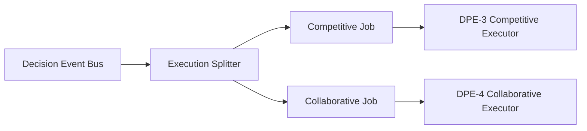

# TAE Execution Splitter (DPE-2)

**Generated:** 2026-09-03T13:15:09+00:00
**Mode:** SHADOW_ONLY — READ_ONLY
**Schema version:** dpe.execution_job.v1
**Experiment ID:** EXP263889

> **Routing only — no execution, no portfolio change, no live behavior change**

## Executive summary

- Decision events processed: **1477**
- Jobs built this run: **2954**
- Jobs appended: **0** (skipped duplicates in run: **2954**)
- Competitive jobs: **1477**
- Collaborative jobs: **1477**
- Blocked jobs: **182**
- Ready jobs: **2772**
- Jobs log: `runtime_outputs/dpe/execution_jobs.jsonl`

## Architecture summary

```text
decision_events.jsonl  →  Execution Splitter  →  execution_jobs.jsonl
                              │
                    ┌─────────┴─────────┐
                    │                   │
             COMPETITIVE            COLLABORATIVE
               (Job A)                (Job B)
                    │                   │
                    └─────────┬─────────┘
                              ▼
                    DPE-3 / DPE-4 Paper Executors
```

## Routing diagram



## Schema version

`dpe.execution_job.v1` — see `tae_execution_splitter.json`

## Metrics

| metric | value |
| --- | --- |
| total_events | 1477 |
| competitive_jobs | 1477 |
| collaborative_jobs | 1477 |
| blocked_jobs | 182 |
| ready_jobs | 2772 |
| queued_jobs | 0 |
| invalid_jobs | 0 |
| duplicate_uuids | 0 |
| duplicate_jobs | 0 |

## Source status

| source | loaded |
| --- | --- |
| runtime_outputs/dpe/decision_events.jsonl | ✅ |
| tae_adaptive_profit_policy_engine.json | ✅ |
| tae_growth_intelligence.json | ✅ |
| tae_market_philosophy_lab.json | ✅ |
| tae_portfolio_profit_governor.json | ✅ |
| tae_profit_growth_analytics.json | ✅ |
| tae_profit_target_adapter.json | ✅ |

## Reuse audit

Artifacts consumed read-only (no upstream Python imports):

- runtime_outputs/dpe/decision_events.jsonl — parent Decision Events (DPE-1)
- tae_growth_intelligence.json — growth_phase, portfolio policy context
- tae_profit_growth_analytics.json — market_regime hints, core metrics
- tae_adaptive_profit_policy_engine.json — policy_state enrichment
- tae_portfolio_profit_governor.json — portfolio_policy in decision_context
- tae_profit_target_adapter.json — target_snapshot passthrough
- tae_market_philosophy_lab.json — philosophy_snapshot passthrough

## What this does not duplicate

- Does not recompute GII scores, profit targets, philosophy models, accounting, or protection logic. Maps existing Decision Event snapshots into dual routing jobs only.

## Ticker job summary

| ticker | competitive | collaborative | reason |
| --- | --- | --- | --- |
| AAPL | READY | READY | DEFENSIVE_POLICY |
| ABBV | READY | READY | DEFENSIVE_POLICY |
| AIR.PA | READY | READY | KEEP_WINNER |
| ALV.DE | READY | READY | KEEP_WINNER |
| AMAT | READY | READY | COLLAPSE_RISK |
| DIA | READY | READY | KEEP_WINNER |
| GE | READY | READY | KEEP_WINNER |
| HD | READY | READY | DEFENSIVE_POLICY |
| HSBA.L | BLOCKED | BLOCKED | COLLAPSE_RISK |
| LLY | READY | READY | DEFENSIVE_POLICY |
| MC.PA | READY | READY | DEFENSIVE_POLICY |
| MRK | READY | READY | DEFENSIVE_POLICY |
| MU | READY | READY | COLLAPSE_RISK |
| NVDA | READY | READY | DEFENSIVE_POLICY |
| PG | READY | READY | DEFENSIVE_POLICY |
| PM | READY | READY | DEFENSIVE_POLICY |
| QQQ | READY | READY | COLLAPSE_RISK |
| SAP.DE | READY | READY | DEFENSIVE_POLICY |
| SHEL.L | READY | READY | DEFENSIVE_POLICY |
| SIE.DE | READY | READY | DEFENSIVE_POLICY |

## Event log path

`runtime_outputs/dpe/execution_jobs.jsonl`

## How this feeds DPE-3

DPE-3 Competitive Paper Executor will consume `COMPETITIVE` jobs with status `READY` from `execution_jobs.jsonl`. DPE-4 handles `COLLABORATIVE` jobs. No execution occurs here.

## Safety confirmation

- READ_ONLY: **true**
- SHADOW_ONLY: **true**
- NO_BROKER: **true**
- NO_EXECUTION: **true**
- NO_PORTFOLIO_CHANGE: **true**
- NO_LIVE_BOT_CHANGE: **true**
- NO_ADVISORY_CHANGE: **true**

## Recommended next sprint

**TAE DPE-3 — Competitive Paper Executor**
